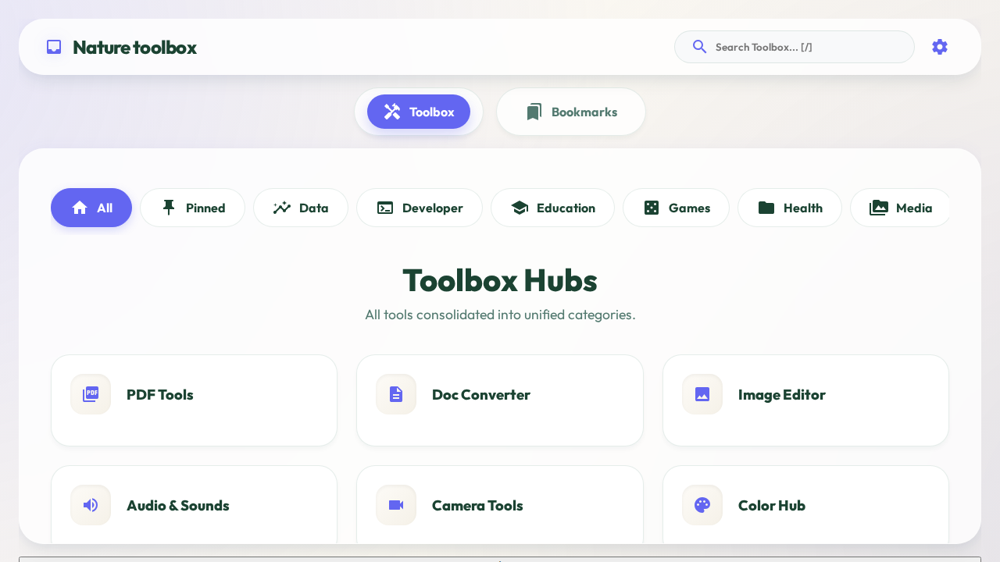

# Epic Toolbox 🌿



Epic Toolbox is a modern, full-stack personal dashboard designed to organize your digital life. Built with a focus on a **"Nature Design Mandate"**, it features organic shapes, earthy colors, and a peaceful user experience, all while packing a massive suite of over 100+ utility tools.

## ✨ About the Project

In an era of cluttered interfaces and fragmented tools, **Epic Toolbox** provides a unified, serene environment for your daily digital tasks. Whether you're a developer needing a quick Regex test, a student looking for a scientific calculator, or just someone who wants a beautiful place to organize their bookmarks, Epic Toolbox is built for you.

The "Nature Design Mandate" isn't just about aesthetics; it's about a **calm workflow**. We use pebble-shaped UI elements, staggered leaf-entry animations, and a palette inspired by the natural world (Forest, Earth, Ocean, and Sunset) to reduce "interface fatigue."

---

## 🚀 Key Features

### 🛠 The Toolbox Hub
A massive collection of consolidated tools organized into 21 category Hubs:
- **AI Hub**: Multi-turn Chat Assistant, Image Generation (Anime, Cyberpunk, etc.), and Story Generation.
- **Data Tools**: High-performance viewers for CSV, JSON, Excel, and Parquet. Includes quality analysis and anonymization.
- **Developer Utilities**: JSON/SQL Formatters, Diff Viewer, UUID Generator, Regex Tester, and Code Converters.
- **Media & Graphics**: PDF Editor, Image Compressor, QR/Barcode Scanner, and Color Palette Hub.
- **Networking**: Real-time Ping, DNS Lookup, SSL Certificate Checker, and IP Info.
- **Games & Fun**: Classic games like Snake, 2048, Sudoku, and Tic-Tac-Toe (Minimax AI).
- **System & Hardware**: Battery status, Sensors (Vibrometer, Sound Meter), and Storage Estimator.

### 🔖 Bookmark Management
- **Multi-Profile Support**: Keep your life organized with **Default**, **Private**, and **Personal** (combined) profiles.
- **Dynamic Categories**: Group links with custom icons and real-time filtering.
- **Smart Search**: Navigate thousands of links and tools instantly using category prefixes (e.g., `cat:dev`).

### 🎨 Personalization & UX
- **Epic Theme 2.0**: 40+ accent colors and true black dark mode support.
- **Visual Effects**: Toggle Glassmorphism, Aurora animated backgrounds, and reduced motion.
- **Offline First**: Full PWA support with Service Worker caching and offline bookmark access.
- **Cross-Platform**: Designed for desktop precision and mobile-first thumb-friendly navigation.

---

## 🛠 Technical Architecture

### Frontend (The SPA)
- **Framework**: React 18 with Vite for lightning-fast builds.
- **Styling**: Pure CSS following a strict token-based system for themes and animations.
- **Optimization**: All 21 tool hubs are **lazy-loaded** to keep the initial bundle small (~200KB gzipped).
- **Security**: Strict Sanitization with `DOMPurify` for all user-generated and searched content.

### Backend (The API)
- **Framework**: FastAPI (Python 3.9+) providing a robust RESTful interface.
- **Database**: SQLite for local persistence, with automatic JSON-to-SQL migration logic.
- **Edge-Ready**: Optimized for Vercel Serverless Functions with ephemeral filesystem handling.

### Core Libraries
- **Mathematics**: `mathjs` for the advanced calculator.
- **Documents**: `pdf-lib`, `jspdf`, and `marked`.
- **Data**: `papaparse` (CSV), `xlsx` (Excel), and `hyparquet`.
- **UI**: `canvas-confetti` and `html2canvas`.

---

## 📖 Getting Started

### Prerequisites
- **Node.js** (v18+)
- **Python** (3.9+)

### Installation
1. **Clone the repo**:
   ```bash
   git clone https://github.com/your-repo/nature-toolbox.git
   cd nature-toolbox
   ```
2. **Setup Backend**:
   ```bash
   pip install -r requirements.txt
   python3 scripts/setup_db.py
   ```
3. **Setup Frontend**:
   ```bash
   npm install
   ```

### Running Locally
- **Backend**: `uvicorn api.index:app --port 8000`
- **Frontend**: `npm run dev -- --port 3001`

---

## 📜 License
MIT © 2024 Epic Toolbox Team
